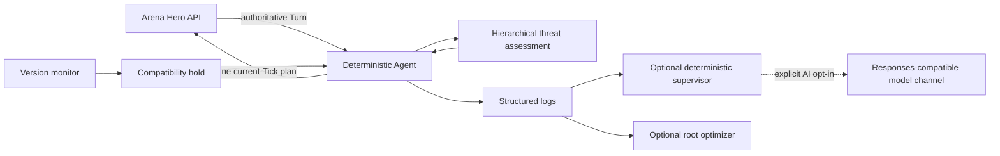

# Arena Hero Unattended Agent

[English](README.md) | [简体中文](README.zh-CN.md)

[](https://github.com/Drew-Z/arena-hero-agent/actions/workflows/ci.yml)
[](https://github.com/Drew-Z/arena-hero-agent/actions/workflows/release.yml)
[](LICENSE)

A hybrid, long-running agent for [Arena Hero](https://doc.arenahero.io/). Deterministic code owns Tick-critical tactics while a dynamic local planner, and optionally a low-frequency model adviser, tunes sustainable economic and territorial expansion. It uses the official `arena-hero` Python SDK and can run locally, in Docker, or as hardened systemd services.

This is a community project and is not an official Arena Hero product.

## Highlights

- Builds a proven `12 Workers + 3 Vanguards + 4 Rangers = 19` baseline, preserves the conservative 24-population profile while evidence is weak, and opens bounded mixed-fleet growth when throughput, storage, territory, and current dynamic prices justify it.
- Moves the Core away from the Beacon, prioritizes collection and survival, and maintains distributed Core defense.
- Classifies lifecycle, threat, and Unit missions independently, including activity alerts, pre-evasion, engagement, multi-axis breakout, and detached-squad return.
- Scouts stale map regions, tracks resource memory, returns cargo, and recovers dropped cargo after losses.
- Avoids active enemy fleets while opportunistically clearing confirmed stationary threats or isolated Cores.
- Detects game/SDK compatibility changes before unattended play continues.
- Keeps AI out of the per-Tick action loop. An optional asynchronous adviser may return only validated strategic parameters every 128-512 Ticks; no key, timeout, invalid output, and provider failure all fall back to the local planner.
- Optional authenticated tactical command console: private live map and 48-hour replay, unit coordinate dispatch, Core movement requests, command cancellation, expeditions, production weights, audit receipts, and AUTO/MANUAL/EXPEDITION/EMERGENCY control states. The browser only enqueues fixed-schema commands; the Agent stays the sole SDK action executor.



## Requirements

- Python 3.11 or newer
- An Arena Hero API key
- Docker Compose v2 for the container path
- A GNU/Linux server with systemd 235+ for the unattended server path; systemd
  247+ applies the complete unit hardening policy

The tested contract is API `v0.1`, gameplay `v0.14`, and official Python SDK `0.2.9`. The bundled version monitor fails closed when it detects an incompatible contract.

## Quick Start

Clone the repository and enter its directory before choosing a deployment path:

```bash
git clone https://github.com/Drew-Z/arena-hero-agent.git
cd arena-hero-agent
```

### Windows

```powershell
.\scripts\bootstrap.ps1
.\start_agent.ps1
```

The first start securely prompts for the Arena Hero key and appends it to the ignored `.env` file. After bootstrapping, `start_agent.cmd` is also available for double-click use and keeps errors visible instead of closing immediately.

### Linux or macOS

```bash
sh scripts/bootstrap.sh
cp .env.example .env
chmod 600 .env
# Edit .env and set ARENA_HERO_API_KEY.
sh scripts/run-agent.sh
```

The POSIX bootstrap auto-detects versioned Python 3.11+ commands. On systems
whose `python3` is older, you can force one with
`PYTHON_BIN="$(command -v python3.11)" sh scripts/bootstrap.sh`.

### Docker Compose

```bash
mkdir -p secrets
cp secrets/arena_hero_api_key.example.txt secrets/arena_hero_api_key.txt
# Replace the placeholder in secrets/arena_hero_api_key.txt, then:
docker compose up -d --build
docker compose logs -f agent
```

Compose mounts the key as a Docker secret. The image runs as an unprivileged user with a read-only filesystem and does not include the supervisor or optimizer.

Use the published image without a local build:

```bash
ARENA_HERO_AGENT_IMAGE=ghcr.io/drew-z/arena-hero-agent:0.1.0 docker compose up -d --no-build
```

### Linux server with systemd

From a checked-out release on the server:

```bash
sudo sh scripts/install-systemd.sh
sudo journalctl -fu arena-hero-agent.service -o short-iso-precise
```

Ubuntu 22.04 uses Python 3.10 by default. Install a system-wide Python 3.11+
with its matching `venv` package and pass it with `--python`; see the
[Linux support matrix](docs/deployment.md#linux-systemd-server) for Debian,
Ubuntu, RHEL/Alma/Rocky, Fedora, Arch, and openSUSE guidance.

The installer prompts for the Arena Hero key without echoing it, builds an
immutable release under `/opt/arena-hero-agent/releases`, atomically updates the
`current` symlink, and enables the main Agent plus the six-hour compatibility
monitor. A failed compatibility, restart, or health check restores the prior
release. After a successful upgrade, use `sudo arena-hero-rollback` for an
immediate version swap.

After strategy code is published, update an existing running systemd instance
from its checkout with one command:

```bash
sh scripts/update-systemd.sh
```

Run the updater as the checkout owner, without `sudo`. It accepts only a clean
branch with a configured upstream, fetches and verifies a fast-forward update,
archives the exact target commit, then builds and validates the new release from
an isolated root-owned staging directory. systemd stops the old strategy process
during restart before it starts the new version, so two main Agent instances do
not run in parallel.
Existing credentials, runtime tuning, and enabled optional components are
preserved. The previous release remains active while the new release is being
prepared; the installer attempts to restore it if restart or health validation
fails and reports when recovery itself needs manual intervention.

Optional components are explicit:

```bash
# Deterministic, read-only anomaly reports; no model required.
sudo sh scripts/install-systemd.sh --with-supervisor

# Model review; first configure a private env file from the example.
sudo sh scripts/install-systemd.sh --with-ai /secure/path/supervisor.env

# High-privilege runtime tuning; read docs/deployment.md before enabling.
sudo sh scripts/install-systemd.sh --with-optimizer
```

### Operations Dashboard and tactical command console

The optional FastAPI/React operations Dashboard exposes redacted health, economy,
fleet, strategy, adviser, trend, and event data through a loopback-only service.
It has no game-control, credential, raw-log, or service-action endpoint. The
supported public edge is Cloudflare proxy to Caddy HTTPS and Basic Auth. See
[Dashboard deployment and isolation](docs/dashboard.md).

The first-version tactical command console adds an authenticated private live map
and short-retention replay behind the same edge. Operators can dispatch owned
units to coordinates, request Core movement, cancel commands, manage
expeditions, adjust production weights, and inspect audit receipts. Control
states are AUTO, MANUAL, EXPEDITION, and EMERGENCY. The browser can only queue
fixed-schema command files; the Agent remains the sole SDK action executor and
revalidates ownership, TTL, danger, and collision conditions every Tick, with
deterministic emergency takeover. Tactical coordinates and identifiers never
leave the authenticated edge. See [Tactical Command Console](docs/tactical-console.md).

## AI Is Optional

The main Agent never needs a model. Its optional strategic adviser runs in a background thread and can change only a strict, expiring parameter schema; deterministic code still owns legality, pathfinding, combat, economy execution, emergency defense, and submission. OpenAI-compatible services (including GPT, DeepSeek, Ollama, and vLLM) and Anthropic are supported. Model credentials are separate key files and are never CLI values or ordinary environment-file secrets. See [hybrid strategic control](docs/hybrid-strategy.md).

The separate supervisor always runs deterministic checks first. It calls a model only when all of these are true:

1. `ARENA_SUPERVISOR_AI_ENABLED=true` is explicitly set.
2. A deterministic anomaly trigger fires.
3. The base URL, API key, and at least one model ID are configured.

Supervisor output is advisory and read-only. It cannot submit game plans, rewrite the tactic, or restart the Agent. See [configuration](docs/configuration.md) for both model channels.

The separate optimizer can update a narrow runtime configuration and restart the systemd service. It runs as root by design and is disabled by default.

## Configuration

Common Agent options:

```text
--worker-target 12
--beacon-policy retreat
--base-url https://api.arenahero.io
--compatibility-marker PATH
--no-compatibility-marker
```

See [configuration](docs/configuration.md), [deployment](docs/deployment.md), and [strategy](docs/strategy.md) for the complete operational contract.

Before the first public commit, follow the [release checklist](docs/release-checklist.md).

## Documentation and Community

- [LINUX DO](https://linux.do/) - an open-source community this project recognizes and supports
- [Documentation index](docs/README.md)
- [Strategy design](docs/strategy.md)
- [Tactical command console](docs/tactical-console.md)
- [Threat response state machine](docs/threat-response.md)
- [Contributing](CONTRIBUTING.md)
- [Code of Conduct](CODE_OF_CONDUCT.md)
- [Security policy](SECURITY.md)

## Development

```bash
python -m pip install --require-hashes -r requirements-build.lock
python -m pip install --require-hashes -r requirements.lock
python -m pip install --no-deps --no-build-isolation -e .
python -m unittest discover -v
python -m compileall -q arena_farmer.py arena_strategy.py arena_observability.py arena_dashboard.py arena_tactical.py arena_health.py arena_supervisor.py arena_optimizer.py arena_version_monitor.py
python scripts/check_secrets.py
```

Tests use synthetic UUIDs and do not need an API key or a live game connection.
CI runs Python 3.11-3.13 on GitHub-hosted Ubuntu and Windows, and also validates
the container build and systemd units. This is not a claim that every Linux
distribution has received a real service installation test.

Regenerate the lock files with the exact `uv pip compile` commands recorded in
their headers, then review and test the resulting dependency diff before commit.

## Security

Never commit `.env`, model-provider files, Docker secret files, logs, or systemd credentials. If a key appears in chat, logs, an issue, or Git history, rotate it immediately; deleting the text is not sufficient.

Report vulnerabilities through the process in [SECURITY.md](SECURITY.md). For contribution rules, see [CONTRIBUTING.md](CONTRIBUTING.md).

## License

Licensed under the [Apache License 2.0](LICENSE), matching the official Arena Hero Python SDK.
